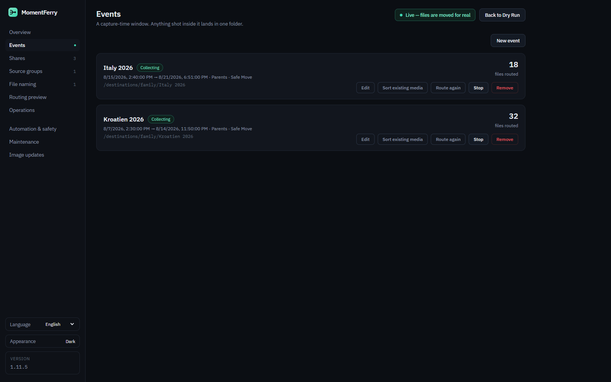
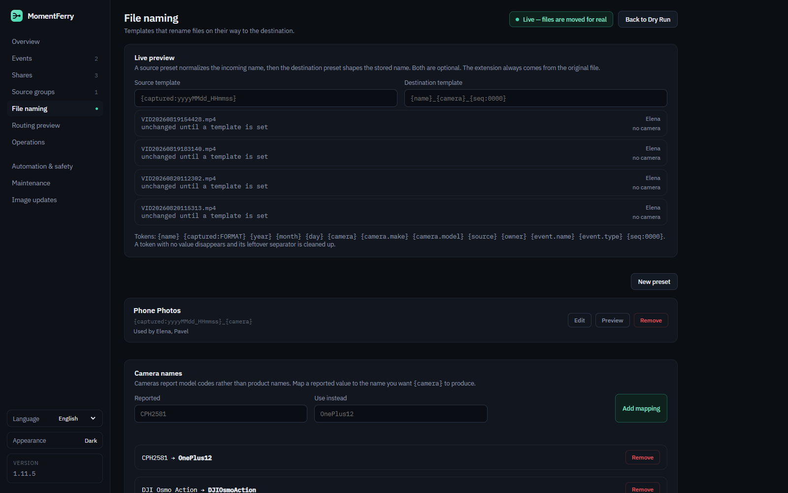
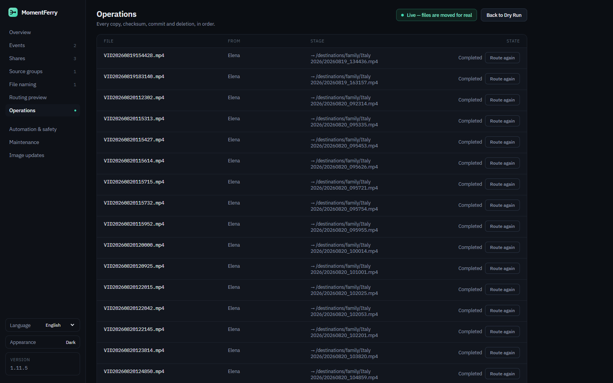
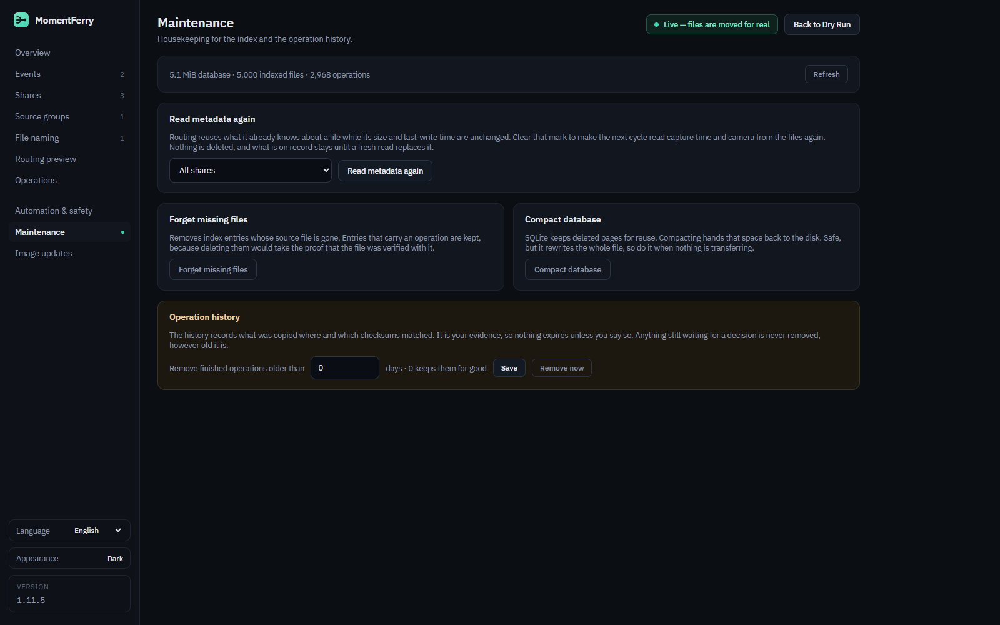

# MomentFerry

MomentFerry — safely bringing your moments together.

MomentFerry is a self-hosted media routing and collection service for synchronized folders.

It watches filesystem shares, identifies photos and videos from metadata, matches them to capture-time events, and safely routes them into shared destination folders. MomentFerry is deliberately sync-tool agnostic: Resilio Sync, Syncthing, Nextcloud clients, FolderSync, SMB uploaders, rsync, or another tool may synchronize the folders. MomentFerry only works with the resulting filesystem paths.

## How it works


## Screenshots

### Overview


### Events



### Share configuration


### File naming



### Operations



### Automation and safety


### Maintenance



## Primary use case

Several phones synchronize their camera folders to a NAS. During a vacation or another event, MomentFerry collects media captured inside the event window into a common destination folder. Existing sync software can then distribute that shared folder back to all participating phones.

Late synchronization is supported: a photo arriving after an event has ended is still matched using its capture timestamp.

## Safety model

The default destructive operation is **Safe Move**:

1. Wait until the source file is stable.
2. Read capture metadata with ExifTool.
3. Match exactly one event.
4. Persist the media file and operation state.
5. Hash the source, then ask whether the destination already holds that exact content — by hash, regardless of the name it was stored under. A match that is still verifiable on disk counts as an identical destination, and the event's duplicate policy decides whether the source is removed.
6. Check destination capacity before opening the staging copy.
7. Copy into a destination-side staging directory.
8. Verify the staged size, the staged SHA-256, and the source SHA-256 again — a source that changed while it was being copied is caught here.
9. Re-resolve the destination path, then commit the verified file.
10. Verify size and SHA-256 once more, in place, and set the committed file's timestamps to the capture time so galleries sort by shooting order. A filesystem that refuses the stamp never invalidates a verified copy.
11. Persist `DestinationCommitted` and `SourceFinalizePending`.
12. Delete the source only after the committed destination is verified.

If MomentFerry cannot prove the destination is safe, the source is preserved. Incomplete operations are reconciled after restart. Transfers for the same media file are serialized in-process to prevent concurrent duplicate execution.

A finished operation keeps a file from being routed a second time only while the file it committed is still at the destination. If that copy is gone, the source is routed again rather than skipped for good.

Real filesystem copies keep a free-space reserve **in addition to the file being copied** — 512 MiB by default, adjustable under Automation & safety — whenever free capacity can be determined. If capacity cannot be determined, MomentFerry reports it as unknown rather than guessing.

**Dry Run is enabled by default**, and leaving it takes an explicit confirmation token that the REST API enforces as well, not only the Web UI. **Automation is enabled by default**, so a fresh container starts scanning immediately: Dry Run is what stands between it and moving files.

## Implemented

- .NET 10 / ASP.NET Core
- SQLite persistence with transactional versioned schema migrations
- downgrade guard when a database is newer than the running application
- Web UI in English, German, Russian, Polish, Italian, French and Ukrainian
- source and destination Shares
- Source Groups
- capture-time Events with start/stop
- image and video discovery
- stable-file detection
- ExifTool metadata extraction
- timezone-aware capture timestamps
- late-sync matching for closed events
- routing preview and event backfill for media that is already on disk
- *Route again* for a single file or a whole event, under the current naming rules
- SHA-256 duplicate verification, including content the destination already holds under another name
- filename conflict handling
- filename templates per share, with camera-name mappings and a live preview
- re-applying the current naming rules to files an event already stored
- per-share media extensions and separate image/video destination subfolders
- destination files stamped with the capture time
- Safe Move and Copy
- persistent operation state machine
- restart recovery and explicit retry
- a *Needs your decision* queue for quarantined and retry-pending files
- end-to-end Safe Move failure-path tests
- per-media transfer serialization
- periodic reconciliation worker
- FileSystemWatcher wake-ups with periodic reconciliation fallback
- persistent runtime settings
- Dry Run / Live mode safety gate
- automation and destination-storage status, manual scans, and an in-app activity log
- Maintenance: re-read metadata, forget missing files, compact the database, expire finished operations
- in-app image updates: check, one-click install, and optional automatic installation through an updater companion
- REST API, OpenAPI JSON and a Swagger UI at `/docs`
- Prometheus metrics at `/metrics` and operation-history CSV export
- optional MQTT event control
- Home Assistant REST and MQTT examples
- Docker / Docker Compose
- GitHub Actions build, tests and container validation
- GHCR publishing workflow

## Quick start

Copy `docker-compose.example.yml` and adapt the NAS paths:

```yaml
services:
  momentferry:
    image: ghcr.io/diddlik/momentferry:latest
    restart: unless-stopped
    ports:
      - "8080:8080"
    volumes:
      - ./data:/app/data
      - /path/to/phone1:/sources/phone1
      - /path/to/phone2:/sources/phone2
      - /path/to/shared:/destinations/family
```

Then start it:

```bash
docker compose up -d
```

Open `http://<server>:8080`.

The `data` volume contains the SQLite database, persistent runtime settings and the last completed automation status. Docker environment values act as initial defaults; settings saved in the Web UI are stored in `data/runtime-settings.json` and take precedence for runtime automation values.

The example file also carries the container healthcheck, the environment defaults matching the settings above, and a commented updater companion. That companion plus `MomentFerry__Updates__WatchtowerUrl` and `__WatchtowerToken` is what lets the in-app *Install update* button actually restart onto the new image; without it MomentFerry only reports that a newer release exists.

When adding a share, use the mounted-folder browser instead of entering a container path manually. Source shares are selected below `/sources`, destination shares below `/destinations`. Folders can be expanded to select any nested directory, so a single root mount can provide several independently configured shares.

## Recommended first setup

1. Keep **Dry Run** enabled.
2. Add each synchronized camera folder as a Source Share.
3. Add the common family folder as a Destination Share.
4. Create a Source Group containing the phone shares.
5. Create and start an Event.
6. Use Routing Preview and verify capture times and destination paths.
7. Check the destination storage status.
8. Only after testing, explicitly enable Live mode if Safe Move/Copy should run automatically.

## REST endpoints

Important endpoints include:

```text
GET  /health
GET  /metrics
GET  /api/v1/info
GET  /api/v1/status
GET  /api/v1/storage
GET  /api/v1/settings
PUT  /api/v1/settings
GET  /api/v1/folders?role=Source
GET  /api/v1/shares
GET  /api/v1/shares/{id}/routing-preview
GET  /api/v1/source-groups
GET  /api/v1/rename-presets
GET  /api/v1/camera-mappings
GET  /api/v1/events/
POST /api/v1/events/{id}/start
POST /api/v1/events/{id}/stop
POST /api/v1/events/quick-start
POST /api/v1/events/quick-stop
POST /api/v1/events/{id}/backfill
POST /api/v1/events/{id}/route-again
POST /api/v1/events/{id}/rename-routed
POST /api/v1/automation/run
GET  /api/v1/operations
GET  /api/v1/operations/export.csv
POST /api/v1/operations/{id}/retry
POST /api/v1/operations/{id}/route-again
GET  /api/v1/quarantine
GET  /api/v1/logs
GET  /api/v1/maintenance
GET  /api/v1/updates
POST /api/v1/updates/check
POST /api/v1/updates/install
POST /api/v1/recovery
```

The full contract is served as OpenAPI JSON at `/openapi/v1.json`, with a browsable UI at `/docs`.

## MQTT

MQTT is optional and disabled by default. Configure it with `MomentFerry__Mqtt__*` environment variables. MomentFerry subscribes to:

```text
momentferry/events/command
```

and publishes responses/status to:

```text
momentferry/events/state
momentferry/status
```

Supported actions are `start`, `stop`, `quick-start`, and `quick-stop`. MQTT controls event windows only and never bypasses the Dry Run / Live transfer safety gate. See the Home Assistant example for payloads.

## Development

```bash
dotnet restore MomentFerry.sln
dotnet build MomentFerry.sln -c Release
dotnet test MomentFerry.sln -c Release
dotnet format MomentFerry.sln --verify-no-changes --no-restore
docker build -t momentferry:dev .
```

Add `-m:1` to the build and test commands on Windows: parallel project builds intermittently collide over file locks there.

CI validates the Release build, automated tests with coverage collection, and the Docker image. The runtime image contains ExifTool and a container healthcheck.

## Documentation

- [Implementation specification](docs/IMPLEMENTATION.md)
- [Architecture](docs/ARCHITECTURE.md)
- [Roadmap](docs/ROADMAP.md)
- [Database migrations](docs/DATABASE-MIGRATIONS.md)
- [Changelog](CHANGELOG.md)
- [Release process](docs/RELEASING.md)
- [Image updates](docs/UPDATES.md)
- [Backup and restore](docs/BACKUP-RESTORE.md)
- [Security policy](SECURITY.md)
- [Contributing](CONTRIBUTING.md)
- [Home Assistant example](examples/home-assistant/README.md)

## Status

Active development past v1.0. Core routing, source-deletion safety, recovery, watcher/reconciliation automation, storage protection, versioned database migrations, filename templates, maintenance tooling, Docker deployment, REST, OpenAPI, optional MQTT control and in-app image updates — including fully automatic installation — are implemented. Remaining work is tracked in the roadmap.
