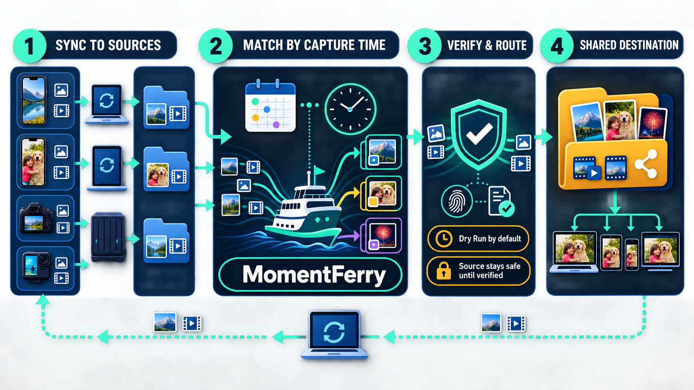
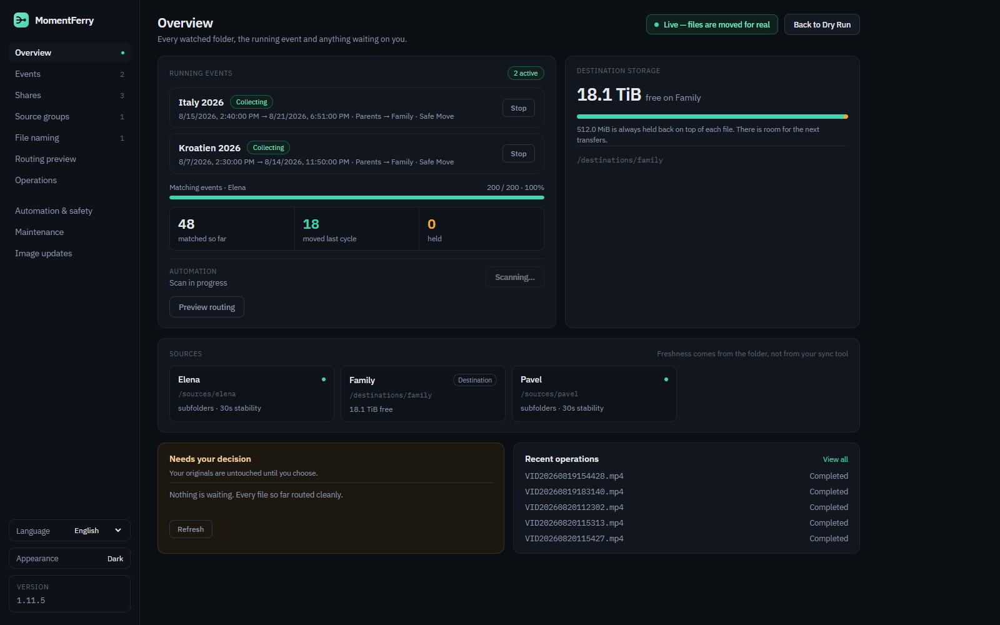
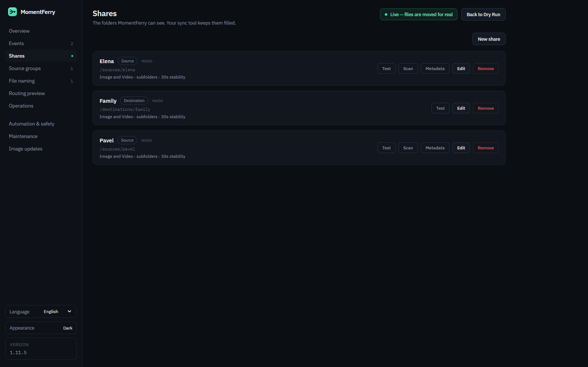
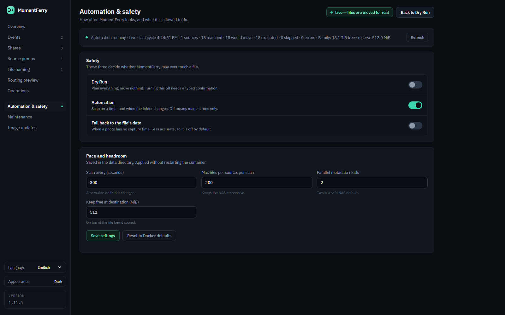

# MomentFerry

MomentFerry — safely bringing your moments together.

MomentFerry is a self-hosted media routing and collection service for synchronized folders.

It watches filesystem shares, identifies photos and videos from metadata, matches them to capture-time events, and safely routes them into shared destination folders. MomentFerry is deliberately sync-tool agnostic: Resilio Sync, Syncthing, Nextcloud clients, FolderSync, SMB uploaders, rsync, or another tool may synchronize the folders. MomentFerry only works with the resulting filesystem paths.

## How it works



## Screenshots

### Overview



### Share configuration



### Automation and safety



## Primary use case

Several phones synchronize their camera folders to a NAS. During a vacation or another event, MomentFerry collects media captured inside the event window into a common destination folder. Existing sync software can then distribute that shared folder back to all participating phones.

Late synchronization is supported: a photo arriving after an event has ended is still matched using its capture timestamp.

## Safety model

The default destructive operation is **Safe Move**:

1. Wait until the source file is stable.
2. Read capture metadata with ExifTool.
3. Match exactly one event.
4. Persist the media file and operation state.
5. Check destination capacity before opening the staging copy.
6. Copy into a destination-side staging directory.
7. Verify size and SHA-256.
8. Commit the verified file to its final destination.
9. Persist `DestinationCommitted` and `SourceFinalizePending`.
10. Delete the source only after the committed destination is verified.

If MomentFerry cannot prove the destination is safe, the source is preserved. Incomplete operations are reconciled after restart. Transfers for the same media file are serialized in-process to prevent concurrent duplicate execution.

Real filesystem copies keep a **512 MiB free-space reserve in addition to the file being copied** whenever free capacity can be determined. If capacity cannot be determined, MomentFerry reports it as unknown rather than guessing.

**Dry Run is enabled by default.** Live transfers require an explicit confirmation in the Web UI.

## Implemented

- .NET 10 / ASP.NET Core
- SQLite persistence with transactional versioned schema migrations
- downgrade guard when a database is newer than the running application
- Web UI in English, German, Russian, Polish, Italian, French and Ukrainian
- source and destination Shares
- Source Groups
- capture-time Events with start/stop
- image and video discovery
- stable-file detection
- ExifTool metadata extraction
- timezone-aware capture timestamps
- late-sync matching for closed events
- routing preview
- SHA-256 duplicate verification
- filename conflict handling
- Safe Move and Copy
- persistent operation state machine
- restart recovery and explicit retry
- end-to-end Safe Move failure-path tests
- per-media transfer serialization
- periodic reconciliation worker
- FileSystemWatcher wake-ups with periodic reconciliation fallback
- persistent runtime settings
- Dry Run / Live mode safety gate
- automation and destination-storage status
- REST API
- optional MQTT event control
- Home Assistant REST and MQTT examples
- Docker / Docker Compose
- GitHub Actions build, tests and container validation
- GHCR publishing workflow

## Quick start

Copy `docker-compose.example.yml` and adapt the NAS paths:

```yaml
services:
  momentferry:
    image: ghcr.io/diddlik/momentferry:latest
    restart: unless-stopped
    ports:
      - "8080:8080"
    volumes:
      - ./data:/app/data
      - /path/to/phone1:/sources/phone1
      - /path/to/phone2:/sources/phone2
      - /path/to/shared:/destinations/family
```

Then start it:

```bash
docker compose up -d
```

Open `http://<server>:8080`.

The `data` volume contains the SQLite database, persistent runtime settings and the last completed automation status. Docker environment values act as initial defaults; settings saved in the Web UI are stored in `data/runtime-settings.json` and take precedence for runtime automation values.

When adding a share, use the mounted-folder browser instead of entering a container path manually. Source shares are selected below `/sources`, destination shares below `/destinations`. Folders can be expanded to select any nested directory, so a single root mount can provide several independently configured shares.

## Recommended first setup

1. Keep **Dry Run** enabled.
2. Add each synchronized camera folder as a Source Share.
3. Add the common family folder as a Destination Share.
4. Create a Source Group containing the phone shares.
5. Create and start an Event.
6. Use Routing Preview and verify capture times and destination paths.
7. Check the destination storage status.
8. Only after testing, explicitly enable Live mode if Safe Move/Copy should run automatically.

## REST endpoints

Important endpoints include:

```text
GET  /health
GET  /api/v1/info
GET  /api/v1/status
GET  /api/v1/storage
GET  /api/v1/settings
PUT  /api/v1/settings
GET  /api/v1/folders?role=Source
GET  /api/v1/shares
GET  /api/v1/events/
POST /api/v1/events/{id}/start
POST /api/v1/events/{id}/stop
POST /api/v1/events/quick-start
POST /api/v1/events/quick-stop
GET  /api/v1/shares/{id}/routing-preview
GET  /api/v1/operations
POST /api/v1/recovery
```

## MQTT

MQTT is optional and disabled by default. Configure it with `MomentFerry__Mqtt__*` environment variables. MomentFerry subscribes to:

```text
momentferry/events/command
```

and publishes responses/status to:

```text
momentferry/events/state
momentferry/status
```

Supported actions are `start`, `stop`, `quick-start`, and `quick-stop`. MQTT controls event windows only and never bypasses the Dry Run / Live transfer safety gate. See the Home Assistant example for payloads.

## Development

```bash
dotnet restore MomentFerry.sln
dotnet build MomentFerry.sln -c Release
dotnet test MomentFerry.sln -c Release
docker build -t momentferry:dev .
```

CI validates the Release build, automated tests and Docker image. The runtime image contains ExifTool and a container healthcheck.

## Documentation

- [Implementation specification](docs/IMPLEMENTATION.md)
- [Architecture](docs/ARCHITECTURE.md)
- [Roadmap](docs/ROADMAP.md)
- [Database migrations](docs/DATABASE-MIGRATIONS.md)
- [Changelog](CHANGELOG.md)
- [Release process](docs/RELEASING.md)
- [Image updates](docs/UPDATES.md)
- [Backup and restore](docs/BACKUP-RESTORE.md)
- [Security policy](SECURITY.md)
- [Contributing](CONTRIBUTING.md)
- [Home Assistant example](examples/home-assistant/README.md)

## Status

Active development. Core routing, source-deletion safety, recovery, watcher/reconciliation automation, storage protection, versioned database migrations, Docker deployment, REST, OpenAPI, optional MQTT control and the initial Web UI update workflow are implemented. Remaining work before v1.0 is tracked in the roadmap.
